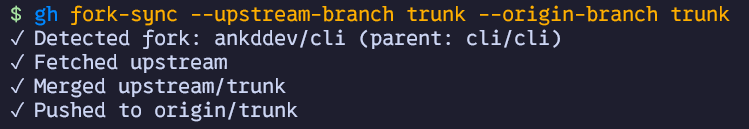

<h1 align="center">gh-fork-sync</h1>
<h6 align="center">GitHub CLI extension to sync your fork with the upstream repository</h6>



## Features

- Sync your fork with the upstream repository
- Rebase instead of merge
- Set upstream and origin branch names
- Force push the changes
- Preview the commands without executing them

## Installation

Firstly, [install the GitHub CLI](https://github.com/cli/cli#installation)

Then, install the extension:

```sh
gh extension install ankddev/gh-fork-sync
```

## Usage


```sh
gh fork-sync <options>
```

To see the list of available options, run:
```sh
gh fork-sync --help
```
### Basic usage
If run without arguments it will sync local `main` branch with the upstream `main` branch and push the changes to the origin.

```sh
gh fork-sync
```

It will execute the following commands:

```sh
git remote add upstream <upstream-repository-url>
git fetch upstream
git merge upstream/main
git push origin HEAD:main
```

> [!TIP]
> You can see what commands will be executed by running `gh fork-sync` with `--dry-run` option.

### Specifying branch names

You can specify the branch names for the upstream and origin repositories.

```sh
gh fork-sync --upstream-branch=main --origin-branch=feature
```

It will execute the following commands:

```sh
git remote add upstream <upstream-repository-url>
git fetch upstream
git merge upstream/main
git push origin HEAD:feature
```

In this example you can omit `--upstream-branch` option, because it will use the default branch name from the upstream repository.

```sh
gh fork-sync --origin-branch=feature
```

### Force push

You can force push the changes to the origin repository by using `--force` option.

```sh
gh fork-sync --force
```

It will execute the following commands:

```sh
git remote add upstream <upstream-repository-url>
git fetch upstream
git merge upstream/main
git push -f origin HEAD:main
```

### Rebase

You can use `--rebase` option to rebase the changes instead of merging them.

```sh
gh fork-sync --rebase
```

It will execute the following commands:

```sh
git remote add upstream <upstream-repository-url>
git fetch upstream
git rebase upstream/main
git push origin HEAD:main
```

Usually you have to use `--rebase` option with `--force` option.

```sh
gh fork-sync --rebase --force
```

It will execute the following commands:

```sh
git remote add upstream <upstream-repository-url>
git fetch upstream
git rebase upstream/main
git push -f origin HEAD:main
```

### Dry run

You can see the commands that would be executed by using `--dry-run` option.

```sh
gh fork-sync --dry-run
```

It will print the commands that would be executed and exit.

## Contributing

Contributions are welcome! Please feel free to submit a PR.

### Build instructions
Clone the repository and run `go build` in the root directory.

```sh
git clone https://github.com/ankddev/gh-fork-sync.git
cd gh-fork-sync
go build
```

Then you can install the extension by running `gh extension install .` in the root directory.

```sh
gh extension install .
```

### Testing

You can test the extension by running `go test` in the root directory.

```sh
go test
```
